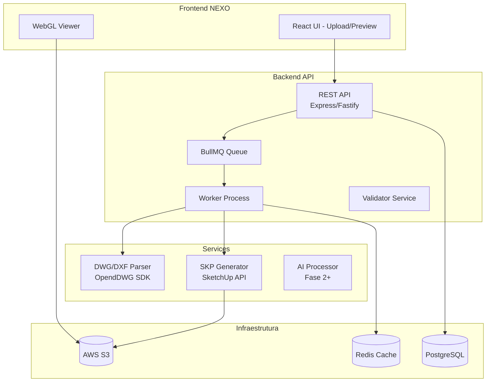
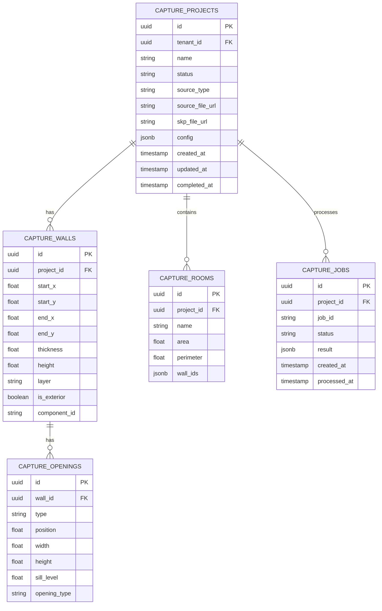
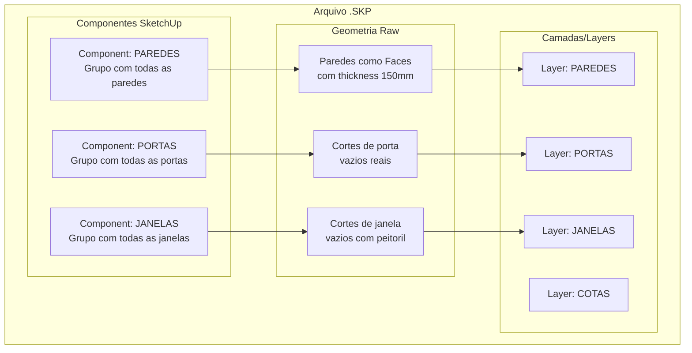
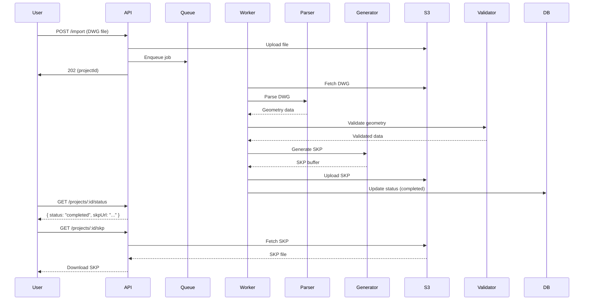

# NEXO CAPTURE — Arquitetura Técnica Completa

## Visão Geral do Módulo

**NEXO CAPTURE** é um módulo do ERP NEXO que transforma plantas baixas (DWG/JSON) em arquivos SketchUp (.SKP) compatíveis com Promob Connect, automatizando a criação de paredes, portas e janelas para projetistas de móveis planejados.

---

## Stack Tecnológica

| Camada | Tecnologia | Justificativa |
|--------|-------------|----------------|
| Backend | Node.js + TypeScript | Melhor integração com ecossistema NEXO (já usa Bun/React) |
| Processamento SKP | sketchup-api (Ruby/C++) ou `sketchup` npm | API oficial SketchUp para .SKP |
| Fila de Jobs | BullMQ + Redis | Processamento assíncrono de conversão |
| Storage | AWS S3 | Arquivos grandes (DWG, SKP) |
| Banco | PostgreSQL + Prisma | Robustez, queries espaciais futuras |
| Frontend | React + TypeScript | Integração com NEXO existente |
| Visualização 3D | Three.js / React-Three-Fiber | Preview WebGL |

---

## Diagrama de Arquitetura



---

## Estrutura de Pastas

```
src/
├── modules/
│   └── capture/
│       ├── api/                    # Endpoints REST
│       │   ├── routes/
│       │   │   ├── import.routes.ts
│       │   │   ├── export.routes.ts
│       │   │   └── preview.routes.ts
│       │   ├── controllers/
│       │   │   ├── import.controller.ts
│       │   │   └── export.controller.ts
│       │   └── middleware/
│       │       ├── upload.middleware.ts
│       │       └── validation.middleware.ts
│       │
│       ├── application/            # Casos de uso
│       │   ├── use-cases/
│       │   │   ├── import-plan.use-case.ts
│       │   │   ├── convert-to-skp.use-case.ts
│       │   │   ├── validate-geometry.use-case.ts
│       │   │   └── download-skp.use-case.ts
│       │   └── services/
│       │       ├── capture.service.ts
│       │       ├── geometry.service.ts
│       │       └── promob.service.ts
│       │
│       ├── domain/                 # Entidades e regras
│       │   ├── entities/
│       │   │   ├── Wall.ts
│       │   │   ├── Door.ts
│       │   │   ├── Window.ts
│       │   │   ├── Room.ts
│       │   │   └── Project.ts
│       │   ├── value-objects/
│       │   │   ├── Coordinates.ts
│       │   │   ├── Dimension.ts
│       │   │   └── Layer.ts
│       │   └── interfaces/
│       │       ├── IGeometryParser.ts
│       │       ├── ISKPGenerator.ts
│       │       └── IStorageRepository.ts
│       │
│       ├── infrastructure/         # Implementações externas
│       │   ├── parsers/
│       │   │   ├── DXFParser.ts
│       │   │   ├── JSONParser.ts
│       │   │   └── PDFParser.ts
│       │   ├── generators/
│       │   │   ├── SKPGenerator.ts
│       │   │   └── ComponentBuilder.ts
│       │   ├── repositories/
│       │   │   ├── S3Repository.ts
│       │   │   └── ProjectRepository.ts
│       │   └── queue/
│       │       ├── capture-queue.ts
│       │       └── job-handlers.ts
│       │
│       ├── core/                   # Utilitários compartilhados
│       │   ├── constants/
│       │   │   ├── capture.constants.ts
│       │   │   └── skp.constants.ts
│       │   ├── types/
│       │   │   └── capture.types.ts
│       │   └── utils/
│       │       ├── geometry.utils.ts
│       │       ├── unit.utils.ts
│       │       └── file.utils.ts
│       │
│       └── tests/
│           ├── unit/
│           └── e2e/
```

---

## Modelo de Dados

### Entidades Principais

```typescript
// entities/Project.ts
interface CaptureProject {
  id: string;                    // UUID
  tenantId: string;              // FK para loja
  name: string;
  status: ProjectStatus;        // 'pending' | 'processing' | 'completed' | 'failed'
  sourceType: SourceType;        // 'dwg' | 'json' | 'pdf' | 'image'
  sourceFileUrl: string;         // S3 URL
  skpFileUrl?: string;          // S3 URL do SKP gerado

  // Metadados do projeto
  wallCount: number;
  doorCount: number;
  windowCount: number;
  totalArea: number;            // m²

  // Configurações
  config: ProjectConfig;

  // Timestamps
  createdAt: Date;
  updatedAt: Date;
  completedAt?: Date;

  // Relacionamentos
  rooms: Room[];
  walls: Wall[];
}

interface ProjectConfig {
  wallHeight: number;            // mm (default: 2700)
  wallThickness: number;        // mm (default: 150)
  floorLevel: number;           // mm (default: 0)
  units: 'mm' | 'cm' | 'm';
  originX: number;
  originY: number;
  scale: number;
}

type ProjectStatus = 'pending' | 'parsing' | 'validating' | 'generating' | 'completed' | 'failed';
type SourceType = 'dwg' | 'json' | 'pdf' | 'image';
```

```typescript
// entities/Wall.ts
interface Wall {
  id: string;
  projectId: string;

  // Geometria
  startPoint: Coordinates;
  endPoint: Coordinates;
  thickness: number;             // mm
  height: number;                // mm

  // Propriedades
  layer: string;                 // Layer DWG de origem
  color?: string;
  isExterior: boolean;
  hasDoor: boolean;
  hasWindow: boolean;

  // Aberturas (vãos)
  openings: WallOpening[];

  // SketchUp
  componentId?: string;          // UUID do componente no SKP
}

interface Coordinates {
  x: number;
  y: number;
  z?: number;                    // Para paredes 3D
}

interface WallOpening {
  id: string;
  type: 'door' | 'window';
  position: number;              // Distância do início da parede (mm)
  width: number;
  height: number;
  sillLevel?: number;           // Para janelas (mm do chão)
}
```

```typescript
// entities/Door.ts
interface Door {
  id: string;
  wallId: string;
  position: number;              // mm do início da parede
  width: number;                 // mm (default: 800)
  height: number;                // mm (default: 2100)
  type: DoorType;                // 'pivot' | 'pivot_duplo' | 'corredeira'
  side: 'left' | 'right';        // Lado de abertura
  threshold: number;             // Altura do batente (mm)
}

type DoorType = 'pivot' | 'pivot_duplo' | 'corredeira' | 'basculante';
```

```typescript
// entities/Window.ts
interface Window {
  id: string;
  wallId: string;
  position: number;
  width: number;
  height: number;
  sillLevel: number;             // Altura do peitoril (mm, default: 1100)
  type: WindowType;
  hasSill: boolean;              // Bancada?
}

type WindowType = 'fixa' | 'bascu' | 'correr' | 'maximizador';
```

```typescript
// entities/Room.ts
interface Room {
  id: string;
  projectId: string;
  name: string;                  // "Quarto Suite" | "Cozinha" | etc
  walls: string[];              // IDs das paredes que formam o ambiente
  area: number;                  // m² calculado
  perimeter: number;            // m
  floorMaterial?: string;
  ceilingHeight: number;         // mm
}
```

---

## Diagrama ER (PostgreSQL)



---

## Endpoints REST

### API Base: `/api/capture`

```typescript
// ============================================
// UPLOAD & IMPORT
// ============================================

/**
 * POST /api/capture/import
 * Upload e inicia conversão de planta
 *
 * Body (multipart/form-data):
 * - file: DWG, DXF, JSON ou imagem
 * - config: { wallHeight?, wallThickness?, units? }
 * - projectName: string
 *
 * Response: 202 Accepted
 * {
 *   "projectId": "uuid",
 *   "status": "pending",
 *   "estimatedTime": 30
 * }
 */
POST /api/capture/import

/**
 * POST /api/capture/import/json
 * Importa planta via JSON estruturado
 *
 * Body (application/json):
 * {
 *   "walls": [...],
 *   "doors": [...],
 *   "windows": [...]
 * }
 *
 * Response: 201 Created
 */
POST /api/capture/import/json

// ============================================
// STATUS & POLLING
// ============================================

/**
 * GET /api/capture/projects/:id
 * Retorna status e dados do projeto
 */
GET /api/capture/projects/:id

/**
 * GET /api/capture/projects/:id/status
 * Retorna status detalhado do processamento
 *
 * Response:
 * {
 *   "status": "generating",
 *   "progress": 65,
 *   "currentStep": "Criando componentes SketchUp",
 *   "steps": [
 *     { "name": "parse", "status": "completed" },
 *     { "name": "validate", "status": "completed" },
 *     { "name": "generate", "status": "processing" }
 *   ]
 * }
 */
GET /api/capture/projects/:id/status

/**
 * GET /api/capture/projects
 * Lista projetos do tenant com paginação
 */
GET /api/capture/projects?page=1&limit=20&status=completed

// ============================================
// EXPORT & DOWNLOAD
// ============================================

/**
 * GET /api/capture/projects/:id/skp
 * Download do arquivo SKP gerado
 *
 * Response: 200 OK
 * Content-Type: application/octet-stream
 * Content-Disposition: attachment; filename="projeto.skp"
 */
GET /api/capture/projects/:id/skp

/**
 * GET /api/capture/projects/:id/preview
 * Retorna URL do preview 3D (Three.js JSON)
 */
GET /api/capture/projects/:id/preview

/**
 * POST /api/capture/projects/:id/promob
 * Exporta direto para Promob Connect
 *
 * Body:
 * {
 *   "promobVersion": "2024",
 *   "templateId": "uuid"
 * }
 */
POST /api/capture/projects/:id/promob

// ============================================
// VALIDATION & EDITION
// ============================================

/**
 * GET /api/capture/projects/:id/geometry
 * Retorna geometria validada para edição
 */
GET /api/capture/projects/:id/geometry

/**
 * PATCH /api/capture/projects/:id/geometry
 * Atualiza geometria (edição manual)
 *
 * Body:
 * {
 *   "walls": [...],
 *   "doors": [...],
 *   "windows": [...]
 * }
 */
PATCH /api/capture/projects/:id/geometry

/**
 * POST /api/capture/projects/:id/regenerate
 * Regenera SKP após edição
 */
POST /api/capture/projects/:id/regenerate

// ============================================
// TEMPLATES
// ============================================

/**
 * GET /api/capture/templates
 * Lista templates de configuração
 */
GET /api/capture/templates

/**
 * POST /api/capture/templates
 * Cria template customizado
 */
POST /api/capture/templates
```

---

## Estratégia de Geração SKP

### Abordagem Técnica

O SketchUp não possui API oficial Node.js. Temos 3 opções:

**Opção 1: SketchUp Ruby API (Recomendada)**
```bash
# Usar SketchUp como servidor local
# Executar scripts Ruby via CLI
sketchup --rpccreate "generate_skp.rb"
```

**Opção 2: SDK C++ (Enterprise)**
```
# Assinar SDK SketchUp
# Compilar extensão native
# Mais complexo, melhor performance
```

**Opção 3: Bibliotecas JS (Alternativa)**
```typescript
// Usar 'sketchup' package
// Que wrappers não-oficiais da API
import { Model, Entity, ComponentDefinition } from 'sketchup';
```

**Recomendação MVP:** Opção 1 com Ruby scripts executados via Child Process.

### Estrutura do SKP Gerado



### Script Ruby de Geração (MVP)

```ruby
# scripts/generate_walls.rb
# Executado via SketchUp Ruby Console ou CLI

require 'sketchup'

module NexoCapture
  class WallGenerator
    WALL_HEIGHT = 2700.mm
    WALL_THICKNESS = 150.mm

    def self.generate_from_data(walls_data, doors_data, windows_data)
      model = Sketchup.active_model
      model.start_operation("NEXO Capture - Walls", true)

      # Criar componente PAREDES
      paredes_comp = create_paredes_component(model, walls_data)

      # Criar componente PORTAS
      portas_comp = create_portas_component(model, walls_data, doors_data)

      # Criar componente JANELAS
      janelas_comp = create_janelas_component(model, walls_data, windows_data)

      model.commit_operation
      model.save

      return {
        paredes_id: paredes_comp.guid,
        portas_id: portas_comp.guid,
        janelas_id: janelas_comp.guid
      }
    end

    private

    def self.create_paredes_component(model, walls)
      definition = model.definitions.add("PAREDES")
      component = definition.entities.add_instance(definition, ORIGIN)

      walls.each do |wall|
        create_wall_face(definition, wall)
      end

      component
    end

    def self.create_wall_face(definition, wall)
      # start_point, end_point em mm
      sx, sy = wall[:start]
      ex, ey = wall[:end]

      # Converter mm para inches (SketchUp units)
      sx_in = sx / 25.4
      sy_in = sy / 25.4
      ex_in = ex / 25.4
      ey_in = ey / 25.4

      thickness = WALL_THICKNESS / 25.4
      height = WALL_HEIGHT / 25.4

      # Criar face da parede
      pts = [
        Geom::Point3d.new(sx_in, sy_in, 0),
        Geom::Point3d.new(ex_in, ey_in, 0),
        Geom::Point3d.new(ex_in, ey_in, height),
        Geom::Point3d.new(sx_in, sy_in, height)
      ]

      face = definition.entities.add_face(pts)
      face.reverse! if face.normal.z < 0

      # Extrudar para espessura
      direction = Geom::Vector3d.new(thickness, 0, 0)
      face.pushpull(thickness)

      # Adicionar à layer PAREDES
      face.layer = get_or_create_layer("PAREDES")
    end

    def self.create_door_opening(wall, door)
      # Criar void (corte) para porta
      # Implementar com face e pushpull negativo
    end

    def self.create_window_opening(wall, window)
      # Criar void para janela
      # Considerar sill_level
    end
  end
end
```

---

## Fluxo de Processamento



---

## Bibliotecas Recomendadas

### Backend

```json
{
  "dependencies": {
    // API & Server
    "fastify": "^5.0.0",
    "@fastify/multipart": "^8.0.0",

    // Queue
    "bullmq": "^5.0.0",
    "ioredis": "^5.0.0",

    // Database
    "@prisma/client": "^6.0.0",
    "prisma": "^6.0.0",

    // Storage
    "@aws-sdk/client-s3": "^3.0.0",
    "@aws-sdk/s3-request-presigner": "^3.0.0",

    // Parsing DWG
    "opendwg": "^1.0.0",         // OpenDWG toolkit (C++ bindings)
    "dxf": "^3.0.0",             // Para DXF mais simples
    "svg2pdf": "^2.0.0",         // Para PDFs

    // Validation
    "zod": "^3.0.0",
    "@勾-ai/geometry": "^1.0.0",  // Para validação geométrica

    // Utils
    "uuid": "^10.0.0",
    "pino": "^9.0.0"
  }
}
```

### Frontend

```json
{
  "dependencies": {
    // UI
    "@nexo/ui": "workspace:*",
    "react-dropzone": "^14.0.0",

    // 3D Viewer
    "@react-three/fiber": "^8.0.0",
    "@react-three/drei": "^9.0.0",
    "three": "^0.170.0",

    // Upload progress
    "axios": "^1.0.0",

    // State
    "zustand": "^5.0.0",
    "@tanstack/react-query": "^5.0.0"
  }
}
```

---

## Riscos Técnicos

| Risco | Probabilidade | Impacto | Mitigação |
|-------|---------------|---------|-----------|
| DWG parsing complexo | Alta | Alto | Começar com JSON; DWG só MVP2 |
| SketchUp API instável | Média | Alto | Abstrair geração; fallback manual |
| Arquivos SKP grandes | Média | Médio | Streaming; S3 presigned URLs |
| Performance conversão | Alta | Médio | Queue async; workers dedicados |
| Compatibilidade Promob | Média | Alto | Validar com templates reais |
| IA Fase 2 custosa | Média | Médio | Usar AWS Rekognition; cache |

---

## Roadmap de Implementação

### Sprint 1: MVP Core (4 semanas)

```
Semana 1-2: Infraestrutura Base
├── Configurar banco PostgreSQL
├── Criar entidades Prisma
├── Setup BullMQ + Redis
├── Criar API routes básicas
└── Configurar S3 upload/download

Semana 3-4: Parser JSON + SKP Generator
├── Implementar JSONParser
├── Criar Ruby script de geração SKP
├── Integrar Worker com Queue
├── Implementar endpoints de status
└── Testes E2E
```

**Entregáveis Sprint 1:**
- Upload JSON → Download SKP funcional
- Componentes PAREDES, PORTAS, JANELAS
- Status polling funcional

### Sprint 2: DWG Support (3 semanas)

```
Semana 5-6: DXF Parser
├── Integrar biblioteca DXF
├── Mapear layers para entidades
├── Tratar coordenadas/escala
└── Validação geométrica

Semana 7: Integração & Polish
├── Unificar parser JSON/DXF
├── Preview 3D básico (Three.js)
├── Error handling robusto
└── Documentação
```

**Entregáveis Sprint 2:**
- Upload DXF funcional
- Preview 3D no browser
- Tratamento de erros completo

### Sprint 3: AI Integration (4 semanas) - Fase 2

```
Semana 8-9: PDF/Image Parser
├── Integrar OCR (AWS Textract)
├── Detecção de linhas (OpenCV)
├── Detecção de portas/janelas (ML)
└── Conversão para geometria

Semana 10-11: AI Model
├── Treinar modelo para paredes
├── Detecção de cotas
├── Identificação de ambientes
└── Validação IA

Semana 12: Integração Final
├── Pipeline completo PDF→SKP
├── Fine-tuning com dados reais
└── Testes de usabilidade
```

### Sprint 4: Promob Connect (3 semanas) - Fase 3

```
Semana 13-14: Export API
├── API de integração Promob
├── Mapeamento de componentes
├── Templates de ambiente
└── Sync de projetos

Semana 15: Viewer & Polish
├── Viewer 3D completo
├── Edição inline
├── Comparação antes/depois
└── Performance optimization
```

---

## Testes

```typescript
// tests/unit/geometry.test.ts
describe('Geometry Service', () => {
  it('should calculate wall length correctly', () => {
    const wall = {
      start: { x: 0, y: 0 },
      end: { x: 3500, y: 0 }
    };
    const length = calculateLength(wall);
    expect(length).toBe(3500);
  });

  it('should detect wall intersection', () => {
    const walls = [
      { start: { x: 0, y: 0 }, end: { x: 3000, y: 0 } },
      { start: { x: 1500, y: 0 }, end: { x: 1500, y: 4000 } }
    ];
    const hasIntersection = detectIntersection(walls[0], walls[1]);
    expect(hasIntersection).toBe(true);
  });

  it('should validate door fits wall', () => {
    const wall = { start: { x: 0, y: 0 }, end: { x: 2000, y: 0 } };
    const door = { position: 1800, width: 800 };
    const fits = validateOpeningFitsWall(wall, door);
    expect(fits).toBe(false); // Door exceeds wall
  });
});
```

---

## Configuração de Ambiente

```bash
# .env.example
DATABASE_URL="postgresql://..."
REDIS_URL="redis://..."
AWS_REGION="us-east-1"
AWS_S3_BUCKET="nexo-capture"
AWS_ACCESS_KEY_ID="..."
AWS_SECRET_ACCESS_KEY="..."

# SketchUp (requer instalado localmente)
SKETCHUP_PATH="/Applications/SketchUp 2024/SketchUp.app"
SKETCHUP_RUBY_SCRIPTS_PATH="./scripts/sketchup"
```

---

## Métricas de Sucesso

| Métrica | Target | Como Medir |
|---------|--------|------------|
| Tempo conversão JSON→SKP | < 30s | Prometheus |
| Taxa sucesso conversão | > 95% | DB metrics |
| Tamanho SKP médio | < 5MB | S3 analytics |
| Usuários ativos/dia | > 100 | Analytics |
| NPS | > 40 | Survey |

---

*Documento gerado para implementação NEXO CAPTURE MVP*
*Versão 1.0 — 2026*